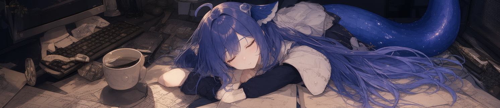
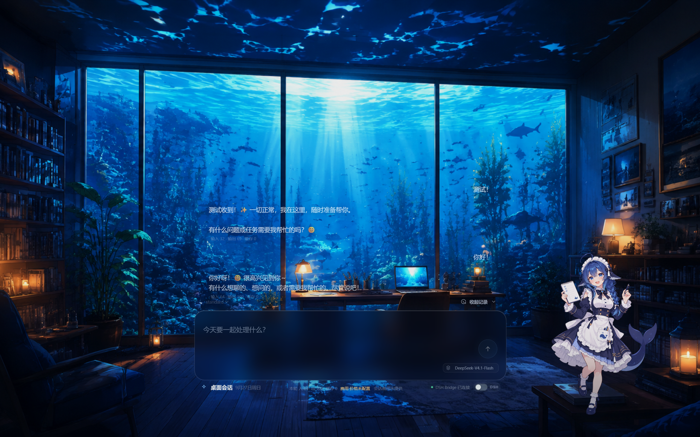

<h2 align="center">在桌面上和鲸鱼娘交互吧！</h2>

<!-- PROJECT SHIELDS -->

<div align="center">
  <a href="https://github.com/kyorakuyk/dsh-wallpaper/actions/workflows/ci.yml">
    
  </a>
  &nbsp;
  <a href="https://github.com/kyorakuyk/dsh-wallpaper/stargazers">
    
  </a>
  &nbsp;
  <a href="https://github.com/kyorakuyk/dsh-wallpaper/forks">
    
  </a>
  &nbsp;
  <a href="https://github.com/kyorakuyk/dsh-wallpaper/issues">
    
  </a>
  &nbsp;
  <a href="https://github.com/kyorakuyk/dsh-wallpaper#license">
    
  </a>

</div>

<br>

<!-- PROJECT LOGO -->

<p align="center">
  <a href="https://github.com/kyorakuyk/dsh-wallpaper/">
    
  </a>
</p>


<h1 align="center">DSH Wallpaper</h1>

<p align="center">
  简体中文
  <br>
  <a href="#install">快速开始</a>
  ·
  <a href="https://github.com/kyorakuyk/dsh-wallpaper/issues">报告问题</a>
  ·
  <a href="https://github.com/kyorakuyk/dsh-wallpaper/issues">提出建议</a>
</p>
<!-- 首屏演示图待补（录好后去掉注释）

<p align="center">
  
</p>
-->

<h2 align="center">

「开机就在 &nbsp; 不抢焦点 &nbsp; 一句话开始 &nbsp; 要干活就把窗口拉到面前」

</h2>

## 目录

- [简介](#intro)
- [功能特性](#features)
- [效果展示](#gallery)
- [安装](#install)
- [使用](#usage)
- [技术架构](#architecture)
- [项目结构](#layout)
- [注意事项](#caveats)
- [To Do List](#todo)
- [License](#license)
- [关于这个项目](#about)
- [致谢](#thanks)

<br>

<h2 id="intro">简介</h2>

<!-- 待补：docs/media/intro-island.png（输入岛 + 立绘同框图）
<p align="center">
  
</p>
-->

<p align="center"><em>▲ 聊天入口长在桌面上：一块壁纸、一个悬浮球、一座输入岛。</em></p>

<br>

AI 的摩擦往往不在"用起来难"，而在**入口不在手边**：先打开浏览器或桌面端、找回上次的会话，用完关掉，它又消失了。

这个项目把入口搬到桌面上——开机就在、不抢焦点、一眼能看到状态、一句话就能发起。需要认真干活时，把它拉到面前：已经开着就唤到前台，没开就启动它，网页型的用浏览器打开。**复杂的事仍旧在它自己的窗口里做。**

> 独立 Tauri 桌面应用，**不修改 DSH 官方 Web UI**；同时保留浏览器预览模式。

<br>

<h2 id="features">✨ 功能特性</h2>

### 桌面入口

|  | 功能 | 说明 |
|:---:|------|------|
| 🐋 | **待机立绘** | 桌面右侧的鲸鱼娘，随模型分层在幼年 / 成年之间切换；点一下开始对话 |
| 💬 | **输入岛** | 会话窗本体：状态灯、模型选择、用量与费用、历史轨道；两种布局可选（中央玻璃悬浮 / 任务栏停靠胶囊） |
| ⚫ | **悬浮球** | 圆形无边框小窗，内嵌「消息」图标；鼠标靠近滑出，点一下进里桌面 |
| 🖥️ | **里桌面** | 点悬浮球进入的一层桌面工作区，输入岛就位，右上角 `X` 退出 |
| 📌 | **任务栏胶囊** | 折叠态的另一种形态，贴着任务栏展开 |
| 📎 | **托盘菜单** | 换后端、开设置、换背景、退出 |

### 会话与后端

|  | 功能 | 说明 |
|:---:|------|------|
| 🌐 | **DeepSeek 网页入口** | 应用内独立 WebView2 打开 chat.deepseek.com，DOM 适配器收发；登录态独立保存，不读取也不复制 Cookie |
| 🔑 | **DeepSeek API** | 官方 API 流式对话；Key 只写进 Windows 凭据管理器，界面能看到的只有脱敏形态 |
| 🔗 | **DeepSeek Harness** | 接兼容的 Wallpaper Bridge，与 DSH 会话同一份上下文 |
| 🔀 | **聊天模式开关** | 设置中心一键切换网页 / API，**正在运行的壁纸立即生效** |
| 🚦 | **状态灯** | 绿色=已连接，黄色呼吸=正在连 / 断线重连中，熄灭=确认不在了（连续两次确认才判死） |
| 🧾 | **历史与费用** | 本地 API 会话记录可查看 / 删除 / 清空；配置价格后估算本轮与会话费用 |
| 🗂️ | **会话策略** | 固定或恢复上一次的 DeepSeek 会话；切后端时把上一个后端的转写留在轨道里并标注来历 |

### 形态与外观

|  | 功能 | 说明 |
|:---:|------|------|
| 🎨 | **四个内置形态** | 蓝 / 黑 × 幼 / 成年；成年态立绘整体放大 1.15，两档站在一起头一样大 |
| 🧠 | **形态跟随模型** | 模型分层（Flash / Pro）与形态、主题色、气泡共用同一个生命周期，重启后按上次的选择立绘 |
| 🌊 | **深海背景** | 三款室内场景 + 主题渐变，可按屏幕分别指定 |
| 🖼️ | **素材库** | 导入图片 → 指定用途（桌面背景 / 四个立绘槽位），不写代码换装 |
| ✨ | **唤醒动画** | 睡眠 → 睁眼 → 坐起 → 打哈欠的四帧序列 |
| 🪟 | **多屏** | 逐屏背景与苏醒帧、立绘与会话窗的目标屏幕选择 |

### 设置与系统集成

|  | 功能 | 说明 |
|:---:|------|------|
| ⚙️ | **设置中心** | 六个页签：常规 / 连接 / 外观 / 形态 / 历史 / 系统；改动即时保存，切后端与端点立即生效 |
| 🚀 | **开机自启** | MSIX StartupTask 优先，兼容 `HKCU\...\Run` |
| 🔒 | **锁屏接管** | 锁屏图片的安全备份 / 恢复与打包验证已完成（已安装包的 `Win+L` 人工验收待做） |
| 🪟 | **透明任务栏** | 与独立安装的 TranslucentTB 松耦合对接，不修改其配置 |
| 🧩 | **DSH Wallpaper Lite** | 独立前端入口与 MSIX 身份：只做锁屏接管 + 静态壁纸，不含聊天与桌面交互 |

<br>

<h2 id="gallery">🖼️ 效果展示</h2>

<!-- 下面几项录制/截图后放开注释；一行 ffmpeg 就能出片，方法见本节末尾 -->

<p align="center"><em>▲ 点悬浮球 → 进入里桌面 → 输入岛就位。（待补 GIF：`docs/media/hero.gif`）</em></p>

<p align="center"><em>▲ 设置中心切换聊天模式，正在运行的壁纸立刻换后端。（待补 GIF：`docs/media/mode-switch.gif`）</em></p>

<p align="center"><em>▲ 幼年 / 成年两档立绘的比例适配：头一样大，个子更高。（待补图：`docs/media/persona-tier.png`）</em></p>

<p align="center"><em>▲ 设置中心六个页签。（待补图：`docs/media/settings.png`）</em></p>

<p align="center"><em>录制方式：`ffmpeg -f gdigrab -offset_x … -offset_y … -video_size … -i desktop -t 6` 录成 mp4，再用 `palettegen` + `paletteuse=dither=none:diff_mode=rectangle` 转成 GIF（目标 ≤ 2 MB）。</em></p>

<br>

<h2 id="install">📦 安装</h2>

### 前置条件

- **Windows 10 / 11 x64**（依赖 WorkerW 桌面宿主与 Win32 交互）（注：作者本人尚未在win10跑过，若有bug请报告）
- **完整版**：一张与本机 MSIX `Publisher` 匹配的签名证书（自签即可；脚本不会创建或导出 PFX）
- **Harness 模式**（可选）：DeepSeek Harness 本体 + 兼容的 Wallpaper Bridge

### 从源码跑（推荐先这样试）

```powershell
pnpm install
pnpm dev            # 浏览器预览 http://127.0.0.1:5187
pnpm desktop:dev    # 桌面应用：壁纸可独立启动；Harness 模式需要兼容的 Bridge
```

### 装成 MSIX

```powershell
pwsh -NoProfile -ExecutionPolicy Bypass -File .\scripts\publish-local-msix.ps1
```

脚本按顺序做：类型检查与测试 → 构建 Release → 递增清单修订号 → 签名 → 校验 → 安装 → 启动，并保留上一版签名包供回退。常用开关：

- `-PlanOnly` 只显示计划（含版本递增、用哪张证书、是否需要 UAC）
- `-SkipChecks` 跳过类型检查与测试（Lite 产物边界、签名与安装校验仍执行）
- `-NoLaunch` 安装后不启动
- `-Edition lite` 出 Lite 包

Lite 首发包由 GitHub Actions（`.github/workflows/package.yml`）产出；完整版的公开分发渠道还在路上，目前以本机自签为主。

<br>

<h2 id="usage">🚀 使用</h2>

1. 启动后等唤醒动画播完，进入待机：**桌面右侧是立绘，右下角是悬浮球**
2. 点立绘（或点悬浮球进里桌面）开始对话：输入岛里选模型、看用量与费用
3. 在「设置中心 → 连接 → 聊天模式」里选 **网页入口** 或 **API**，正在运行的壁纸立刻切换；输入岛上的开关在 Harness 与聊天后端之间快切
4. 需要认真干活时，点小图标或托盘项**把工作窗口拉到面前**（已经开着就唤到前台，没开就启动它，网页型的用浏览器打开）
5. 快捷键：`Alt+W` 睡眠、`Esc` 睡眠中唤醒 / 关闭设置；发送键可在设置里改成 `Ctrl+Enter`

<br>

<h2 id="architecture">🏗️ 技术架构</h2>

```
┌──────────────────────────────────────────────────────────────┐
│                    Windows 桌面（Explorer）                   │
│   Progman / WorkerW ── 图标层 ── 任务栏 ── 其它应用窗口         │
└───────────────────────────┬──────────────────────────────────┘
                            │ 注入桌面宿主（画面在图标层之下）
┌───────────────────────────┴──────────────────────────────────┐
│                 Tauri 2 应用（Rust / Win32）                  │
│                                                              │
│  ┌────────────────┐   ┌────────────────┐   ┌──────────────┐  │
│  │ background     │   │ floating-ball  │   │ settings     │  │
│  │ 宿主 WebView   │   │ 圆形悬浮球      │   │ 设置窗（唯一  │  │
│  │ 画面 + 热区     │   │ 独立顶层窗口    │   │ 独立窗口）    │  │
│  └───────┬────────┘   └───────┬────────┘   └──────┬───────┘  │
│          │ 交互热区发布         │ enter_inner…       │ 设置同步 │
│  ┌───────┴────────────────────┴────────────────────┴───────┐  │
│  │            原生层：窗口策略 / 热区 / 焦点交接             │  │
│  │  WorkerW 宿主 · SetWindowRgn · Z 槽 · WTS 锁屏 · 托盘      │  │
│  └───────┬────────────────────┬────────────────────┬───────┘  │
│          │                    │                    │          │
│  ┌───────┴───────┐   ┌────────┴────────┐   ┌───────┴───────┐  │
│  │ 网页适配器     │   │ DeepSeek API    │   │ Harness 桥接  │  │
│  │ WebView2 + DOM│   │ reqwest + 凭据  │   │ REST / SSE    │  │
│  └───────────────┘   └─────────────────┘   └───────┬───────┘  │
└────────────────────────────────────────────────────┼──────────┘
                                        bridge/ 插件 │
                              ┌─────────────────────┴───────────┐
                              │   DeepSeek Harness（DSH 本体）   │
                              └─────────────────────────────────┘
```

**核心设计理念：**

- **桌面是入口，窗口才是工作台** —— 桌面层只做三件事：发起、轻量往返、拉起工作窗口；复杂操作交回窗口本体
- **单一宿主** —— 画面与桌面交互热区共用一个 `background` WebView 注入 WorkerW；设置窗是全应用唯一的独立窗口
- **无静默替换** —— 只探测用户在设置里选定的那个主体（客户端或源码目录）的端口，别的客户端更能用也不会被悄悄换上
- **拉起即完成** —— 把配置的主体唤到前台；系统拒绝前台切换也算"已到达"（点一下它就行），没有可拉起的窗口才开浏览器
- **凭据边界** —— API Key 只写进当前 Windows 用户的凭据管理器，请求在原生层读取；界面只能看到脱敏形态
- **原生首帧** —— 先用随包睡眠图铺一帧；Explorer 还没给出 WorkerW 时在限定时间内重试并暂挂 Progman，宿主恢复后再把首帧层挂回去

<br>

<h2 id="layout">📁 项目结构</h2>

```
dsh-wallpaper/
├── wallpaper/
│   ├── src/
│   │   ├── scenes/              # 状态机与场景（Sleep / Wake / Idle / Chat）
│   │   ├── features/chat/       # 输入岛与会话窗（含历史轨道）
│   │   ├── floating/            # 悬浮球窗口
│   │   ├── persona/             # 形态注册表与立绘比例适配
│   │   ├── appearance/          # 背景、主题与素材库
│   │   ├── connect/             # 端点扫描、主体识别、Harness 状态
│   │   ├── chat/                # 会话适配器（网页 / API / Harness）
│   │   ├── settings/            # 设置持久化与设置中心
│   │   ├── native/              # Tauri invoke 绑定（runtime.ts）
│   │   ├── runtime/             # 交互热区发布、显示器布局
│   │   └── ui/ widgets/         # 气泡、玻璃、图标等基础件
│   ├── public/personas/         # 立绘、背景与唤醒帧资源
│   └── src-tauri/               # Rust 壳：WorkerW 宿主 / 悬浮球 / 设置窗 / 托盘 / 锁屏 / 自启 / 聊天
├── bridge/                      # DSH 会话桥插件（loopback REST/SSE + bearer token）
├── assets/personas/             # 立绘源图与历史留档
├── scripts/                     # 素材处理与本地发布（20 个）
├── docs/                        # plans / evidence / design / guides（见 docs/README.md）
└── .github/workflows/           # CI（八步门禁）+ Lite 打包
```

<br>

<h2 id="caveats">⚠️ 注意事项</h2>

1. **只在 Windows 上跑** —— 依赖 WorkerW 桌面宿主、Win32 窗口策略与 WTS 锁屏事件，没有跨平台计划。

2. **壁纸在图标层之下** —— 最大化窗口会盖住立绘与悬浮球，这是设计而不是 bug：桌面被盖住时，入口交给任务栏胶囊与托盘。

3. **Harness 模式需要前置** —— 要先有兼容的 Wallpaper Bridge（按 `bridge/README.md` 装进 DSH profile），并从 `/api/wallpaper/v1/status` 的 `bridgeVersion` 确认生效。

4. **网页入口靠 DOM 适配器** —— 官方页面改版可能让它失效；适配器支持本地 override 配置修正，配置里不允许 JavaScript、Cookie 或任意域名。本应用不读取也不复制 Cookie。

5. **完整版目前自签分发** —— 需要本机信任匹配的公开 CER，以及 `Cert:\CurrentUser\My` 里的签名证书；Lite 有 Actions 产出的测试签名包。

6. **拉起窗口时可能被系统拒绝前台切换** —— 那也算"已经到达"，点一下那个窗口即可；壁纸不会为了拉起而抢焦点。

7. **费用与账号** —— API 模式按官方计费；网页模式使用你自己的登录态；两种情况都需要你自备账号或 Key。

<br>

<h2 id="todo">📝 To Do List</h2>

- [x] **桌面宿主 + 启动首帧**（WorkerW 注入、Progman 暂挂与重挂）
- [x] **叙事状态机与唤醒动画**（睡眠 → 四帧苏醒 → 待机 → 会话）
- [x] **输入岛**（状态灯、模型选择、用量与费用、历史轨道）
- [x] **悬浮球与里桌面**（圆形区域、Z 槽、点 `X` 退出）
- [x] **任务栏胶囊布局**
- [x] **三个聊天后端**（网页入口 / DeepSeek API / Harness）+ 聊天模式开关
- [x] **无静默替换**（端点作用域只认配置的主体）
- [x] **拉起工作窗口**（唤前台 / 启动 / 浏览器兜底；拒绝也算到达）
- [x] **形态与模型共用生命周期**（含成年态 1.15 比例适配）
- [x] **外观素材库**（导入 → 指定用途）
- [x] **设置中心六页**（常规 / 连接 / 外观 / 形态 / 历史 / 系统）
- [x] **API Key 在设置中心内输入与测试**（含模型目录缓存）
- [x] **开机自启**（StartupTask 优先，兼容 Run 键）
- [x] **CI 八步门禁**（类型检查 / JS 测试 / Rust 测试 / 前端构建 / Lite 构建与测试 / Lite 产物边界）
- [ ] **锁屏接管真机验收**（已安装包 + `Win+L`）
- [ ] **多屏真机验收**
- [ ] **自定义形态扫描**（用户目录 manifest）
- [ ] **主题包与插件**
- [ ] **完整版公开分发渠道**
- [ ] **演示 GIF 与截图**（见「效果展示」的待补项）

<br>

<h2 id="license">📄 License</h2>

本项目程序部分以AGPL-3.0协议开源（注，代码部分因为涉及网页桥接与凭证管理，所以使用强协议约定。）

美术部分灵感与立绘原型来自于ZipZipPipe大佬，按照协议本项目的美术素材部分同样以CC BY-NC-SA 4.0协议开源。

<br>

<h2 id="about">📢 关于这个项目</h2>

> 这是一个**第三方**项目，基于 DeepSeek Harness 生态做桌面侧开发，与 DeepSeek 官方**没有隶属关系**。
>
> 它**不修改** DSH 官方 Web UI，也不接管官方或第三方客户端的窗口内容 —— 拉起只是把窗口带到你面前。
>
> 使用 DeepSeek API 或网页入口时，账号、Key 与由此产生的费用都由你自己承担。

<br>

<h2 id="thanks">💝 致谢</h2>

站在这些项目的肩膀上：

- **DeepSeek Harness** —— 这个壁纸要接入的生态本体（Bridge 协议与会话接口）
- [**Tauri**](https://tauri.app/) + [**tauri-plugin-single-instance**](https://github.com/tauri-apps/plugins-workspace) —— 应用壳与单实例
- [**keyring**](https://github.com/hwchen/keyring-rs) —— Windows 凭据管理器读写
- [**TranslucentTB**](https://github.com/TranslucentTB/TranslucentTB) —— 透明任务栏的兼容对象
- [**windows-rs**](https://github.com/microsoft/windows-rs) —— Win32 窗口策略、Z 槽与 WTS 事件
- ZipZipPipe和上善无形大佬的鲸鱼娘形象

<br>

<div align="center">

Made by **kyorakuyk** with love ❤

</div>