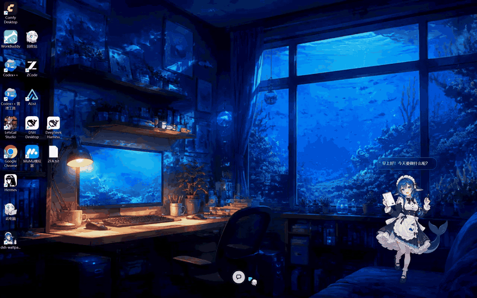
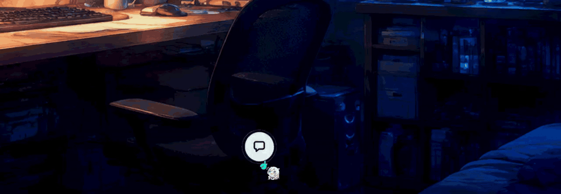
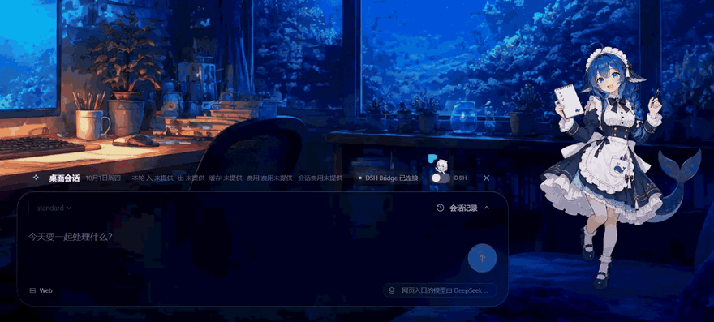
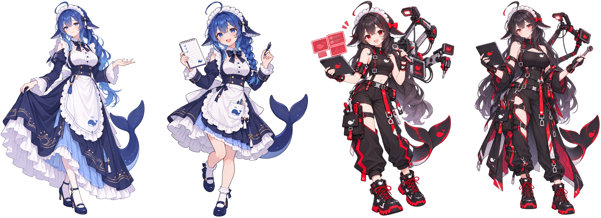
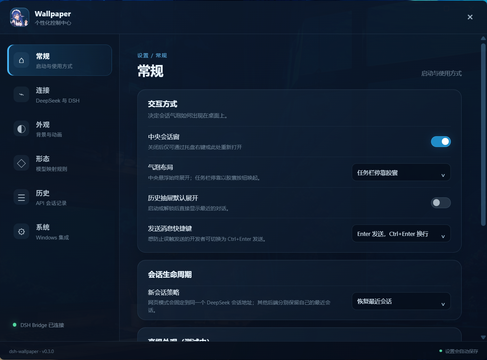

English · [简体中文](README.md)

<!-- PROJECT SHIELDS -->
<p align="center">
  <a href="https://github.com/kyorakuyk/dsh-wallpaper/actions/workflows/ci.yml"></a>
  
  
  
</p>

<!-- PROJECT LOGO -->
<p align="center">
  
</p>

<h2 align="center">Chat with your whale girl, right on the desktop</h2>

<p align="center">
  <a href="https://github.com/kyorakuyk/dsh-wallpaper/releases/latest"><b>Download the installer</b></a>
  ·
  <a href="https://github.com/kyorakuyk/dsh-wallpaper/issues">Report a problem</a>
</p>

<p align="center">
  <a href="docs/media/hero.mp4"></a>
</p>

> **Note on language:** the application interface is currently **Chinese only**. There is no
> translation layer in the code yet. This README is the English front door; the app itself will
> speak Chinese to you.

## What it is

An interactive desktop wallpaper for Windows: a whale girl who sleeps on your desktop, wakes up
when you unlock, idles beside your work, and talks to you through an input island that slides out
when you need it.

It is a wallpaper, not a window manager: the character and the input island live **inside the
desktop** (injected into the `WorkerW` host that Explorer leaves for wallpapers), so nothing is
covered and nothing steals focus. Settings live in a normal window of their own.

## Three backends

| | Backend | What it means |
|:---:|------|------|
| 🌐 | **DeepSeek web** (DOM bridge) | An in-app WebView2 pointed at chat.deepseek.com, driven through a DOM adapter. Sign-in state is stored separately; cookies are never read or copied. |
| 🔑 | **DeepSeek API** | The official streaming API. The key goes into Windows Credential Manager and the UI only ever sees a masked form of it. |
| 🔗 | **DeepSeek Harness** | Talks to a compatible Wallpaper Bridge and shares the context of your DSH session. |

Switching happens from the settings centre and takes effect on the running wallpaper immediately.

## What it can do

**On the desktop**

| | Feature | Notes |
|:---:|------|------|
| 🐋 | **Idle character** | On the right of the desktop, switching between child and adult as your model tier changes; click to start talking |
| ✨ | **Wake animation** | Four frames: asleep, eyes open, yawn, awake (`variant-anima`, 3840×2400); playback starts on the sleeping frame after an unlock |
| 💬 | **Input island** | Slides out for a conversation and gets out of the way again; model picker lives here for the API backend |
| 🚦 | **Status light** | Green connected, amber breathing while connecting or reconnecting, dark when confirmed gone (two confirmations before giving up) |
| 🖥️ | **Multi-monitor** | Enumerates displays; background, wake animation and the conversation window can target a chosen screen |

**Settings, appearance and system integration**

| | Feature | Notes |
|:---:|------|------|
| ⚙️ | **Settings centre** | Six tabs; changes save as you make them |
| 🎨 | **Four built-in personas** | Blue and red, each in child and adult form; adult portraits are scaled up 1.15 |
| 🌊 | **Deep-sea backgrounds** | Three illustrated interiors plus a default gradient |
| 🧾 | **History and cost** | Local API conversations can be viewed, deleted or cleared; with prices configured it estimates the cost of a turn and of a session |
| 🚀 | **Start at login** | Writes `HKCU\...\Run`, pointing at a stable install path; no package identity required |
| 🔌 | **Bridge alignment** | On launch and when you pick a subject, the bridge is brought to the pinned version; a matching version means nothing runs, and a version-exemption prompt is passed to you rather than accepted for you |
| 🧩 | **Lite edition** | A second front end and Rust feature set in the same repository: static wallpaper, the wake animation, autostart — no chat, no desktop interaction |

## Gallery

<p align="center">
  <a href="docs/media/getin.mp4"></a>
</p>
<p align="center"><em>Click the floating ball to enter the inner desktop, and the input island takes its place.</em></p>

<p align="center">
  <a href="docs/media/mode-switch.mp4"></a>
</p>
<p align="center"><em>Switching the chat mode re-points the running wallpaper immediately.</em></p>

<p align="center">
  
</p>
<p align="center"><em>The four personas: child and adult share a head size; the adult is taller.</em></p>

<p align="center">
  
</p>
<p align="center"><em>The settings centre: general, connections, appearance, personas, history, system.</em></p>

## Install

**Requirements:** Windows 11 x64, with WebView2 (included in Windows 11). Windows 10 has not been
tested by the author; bug reports are welcome.

Download `dsh-wallpaper_<version>_x64-setup.exe` from
[Releases](https://github.com/kyorakuyk/dsh-wallpaper/releases) and run it. It installs for the
current user, asks for no administrator rights and needs no certificate. Uninstall through
"Apps & features".

The installer is unsigned, so Windows SmartScreen will warn you the first time: choose
**More info** and then **Run anyway**. That is what an unsigned installer costs; it does not mean
the package is damaged.

**For the Harness backend** you need DSH on the machine — the official desktop client, or the CLI
from `npm i -g @deepseek-ai/dsh`. The wallpaper aligns the bridge into the profiles it needs by
itself and says why in settings when it cannot. If DSH asks you to grant an exact-version
exemption, that decision is yours: the wallpaper passes the prompt on and never accepts it for you.

## Run from source

```powershell
pnpm install
pnpm dev             # browser preview at http://127.0.0.1:5187
pnpm desktop:dev     # the desktop application
```

The wallpaper starts on its own; the Harness backend needs a compatible Wallpaper Bridge.

## Packaging

```powershell
pnpm desktop:build                                    # output under wallpaper/src-tauri/target/release/bundle/nsis/
pwsh -File .\scripts\publish-local-nsis.ps1 -Install  # gates, build, SHA-256, silent install
```

The publishing script runs the type check, the frontend and bridge tests and the Rust tests before
building, prints the hash of the artifact it produced, and only then installs. Useful switches:
`-PlanOnly` prints the plan without touching anything, `-SkipChecks` skips the gates, `-NoLaunch`
does not start the app afterwards, `-Edition lite` builds the Lite package.

An **MSIX** path also exists (`scripts/publish-local-msix.ps1`) for a future store listing. It
needs a signing certificate matching the manifest's `Publisher`. The product itself no longer needs
it — package identity was only ever required by the lock-screen feature, which has been removed —
so day-to-day distribution goes through the `setup.exe` above.

## Structure

```
dsh-wallpaper/
├── wallpaper/                   # the application
│   ├── src/                     # frontend: scenes, settings, native runtime, connect layer
│   ├── public/personas/         # portraits, backgrounds and wake frames
│   └── src-tauri/               # Rust shell: WorkerW host, settings window, tray, autostart, chat
├── bridge/                      # the DSH plugin that connects the wallpaper to a session
├── scripts/                     # build, publish and asset scripts
├── docs/                        # guides, plans, evidence and media
└── archive/                     # frozen modules, kept with the reason they were frozen
```

## Development

```powershell
pnpm typecheck      # TypeScript
pnpm test           # frontend and bridge tests
cargo test --manifest-path wallpaper/src-tauri/Cargo.toml --locked --all-targets
pnpm build:lite     # the Lite front end
```

CI runs three jobs in parallel on Windows (frontend, Rust, Lite) and ignores documentation-only
pushes, so a README change no longer costs a full Rust build.

## Where to look when something is wrong

- **Application log**: `%LOCALAPPDATA%\com.dsh.wallpaper\logs\dsh-wallpaper.log` — settings, the
  bridge and host state are all written here.
- **Startup first-frame diagnostic**: `startup-diagnostic.log` in the same directory. When the
  first frame fails to attach to `WorkerW`, or when Explorer restarts, native events are written
  here line by line (for example `event=reattach parent=WorkerW`). This is the first place to look
  when the wallpaper does not appear or the screen stays black.
- **Bridge token**: `$DSH_HOME\wallpaper\bridge-token`, created by the bridge with permissions
  tightened to your account alone. When it cannot be read, settings says why.

## Artwork and licence

- **Code: MIT** — see [LICENSE](LICENSE).
- **Artwork: CC BY-NC-SA 4.0** (non-commercial, attribution, share-alike) — the portraits, the wake
  frames and the backgrounds, which came with the prototype. See [LICENSE-ASSETS.md](LICENSE-ASSETS.md)
  for the details and the artists' attribution.

Because this project bridges a web page and handles credentials, its safety does not rest on the
licence but on other things: a signed release channel, a bridge control surface that exposes only
what the wallpaper needs, and a host that reports what it could not do instead of guessing.
